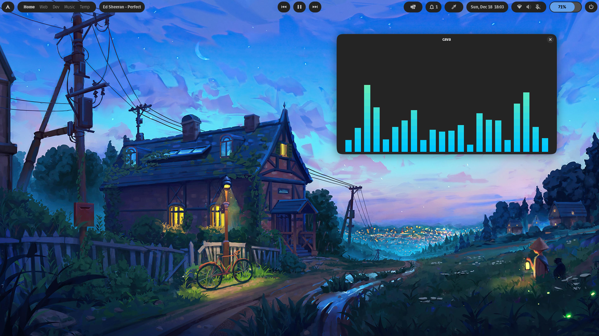

# Village-Linux-rice
### Gnome shell >= 42

## Extensions used

<ul>
<li><a href="https://extensions.gnome.org//extension/5338/aylurs-widgets/">Aylur widgets</a></li>
<li>Color Picker (Optional)</li>
<li>Rounded-window-corners (For rounded corners)</li>
</ul>

## Instructions

<ul>
<li>Download the <b>Jasper-Dark-modified</b> theme, Original theme <a href = "https://github.com/vinceliuice/Jasper-gtk-theme"/>
<li>Install required extensions + set the wallpaper</li>
<li>I've shared the arch logo, select dashboard icon as arch-logo.svg or love.png</li>
