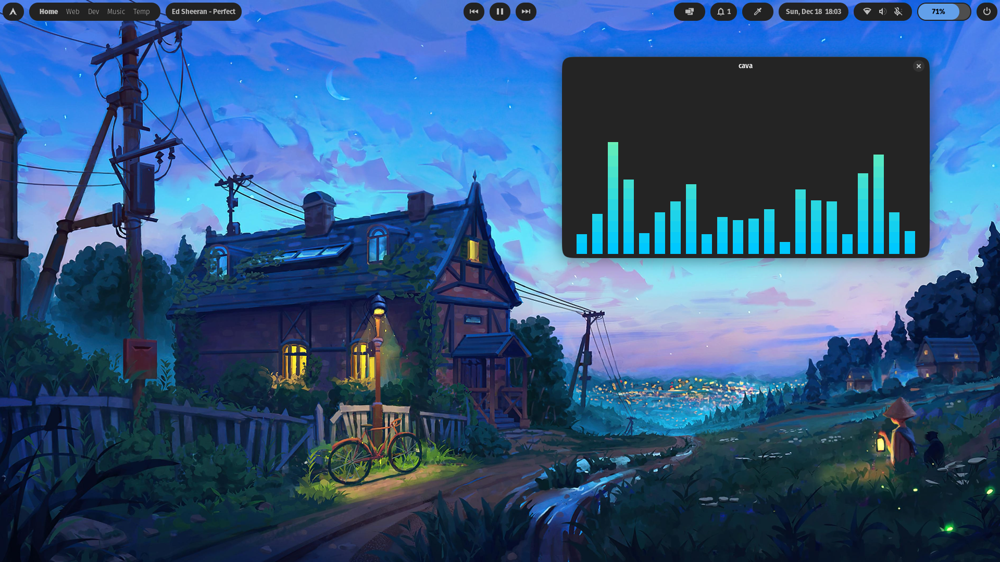

# Village-Linux-rice
### Gnome shell >= 42

## Extensions used

<ul>
<li><a href="https://extensions.gnome.org//extension/5338/aylurs-widgets/">Aylur widgets</a></li>
<li>Color Picker (Optional)</li>
<li>Rounded-window-corners (For rounded corners)</li>
</ul>

## Instructions

<ul>
<li> Clone the repository</li>
<li> Copy Jasper-dark-modified to .local/themes</li>
<li> Set Tela circle icon theme and set Jasper-dark-modified as theme using gnome tweaks</li>
<li> Download extensions</li>
<li> Configure Aylur's widgets accordingly</li>
<li> For dashboard I've provided logos is logos/ folder</li>
</ul>
